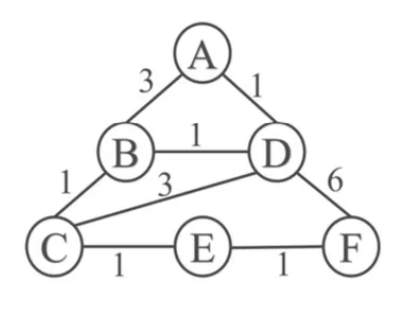

# Routing Algorithm

Practice about routing algorithm, using python

---

### Dijkstra and A*

- Dijkstra

  After testing, Dijkstra can correctly find the smallest road to destination.

- A*

  And A* may not find the best solution.

  However, A* can find the estimate optimal solution and with higher efficiency.

---

### A* Heuristic

I using the absolute distance between nodes and the destination for heuristic function.

Compared to Dijkstra's algorithm, you need to input every node's coordinate.

**Please install numpy first, I use it for distance compute.**

---

### Example

You can find the data of the graph in graph_data.txt.

#### Graph1


- Result ( Dijkstra )

```bash
Please input start: 0
node       |  A  B  C  D  E  F  G  H  I  
min dis    |  0  1  3  2  4  5  6  8  6  
Last node  |  A  A  B  A  C  C  D  I  E  
--------------------------------------------
Complete with 49 rounds.
```

- Result ( A* )

```bash
Please input start: 0
node       |  A  B  C  D  E  F  G  H  I  
min dis    |  0  1  3  2  4  5  6  9  6  
Last node  |  A  A  B  A  C  C  D  G  E  
--------------------------------------------
Complete with 41 rounds.
```

#### Graph2



- Result ( Dijkstra )

```bash
Please input start: 0
node       |  A  B  C  D  E  F  
min dis    |  0  2  3  1  4  5  
Last node  |  A  D  B  A  C  E  
--------------------------------------------
Complete with 24 rounds.
```

- Result ( A* )

```bash
Please input start: 0
node       |  A  B  C  D  E  F  
min dis    |  0  2  3  1  4  5  
Last node  |  A  D  B  A  C  E  
--------------------------------------------
Complete with 24 rounds.
```

Chiao Tung Campus

- Result( Dijkstra )

```bash
Please input start: 0
Please input destination: 11
0 to 11 smallest distance: 289
Complete with 312 rounds.
```